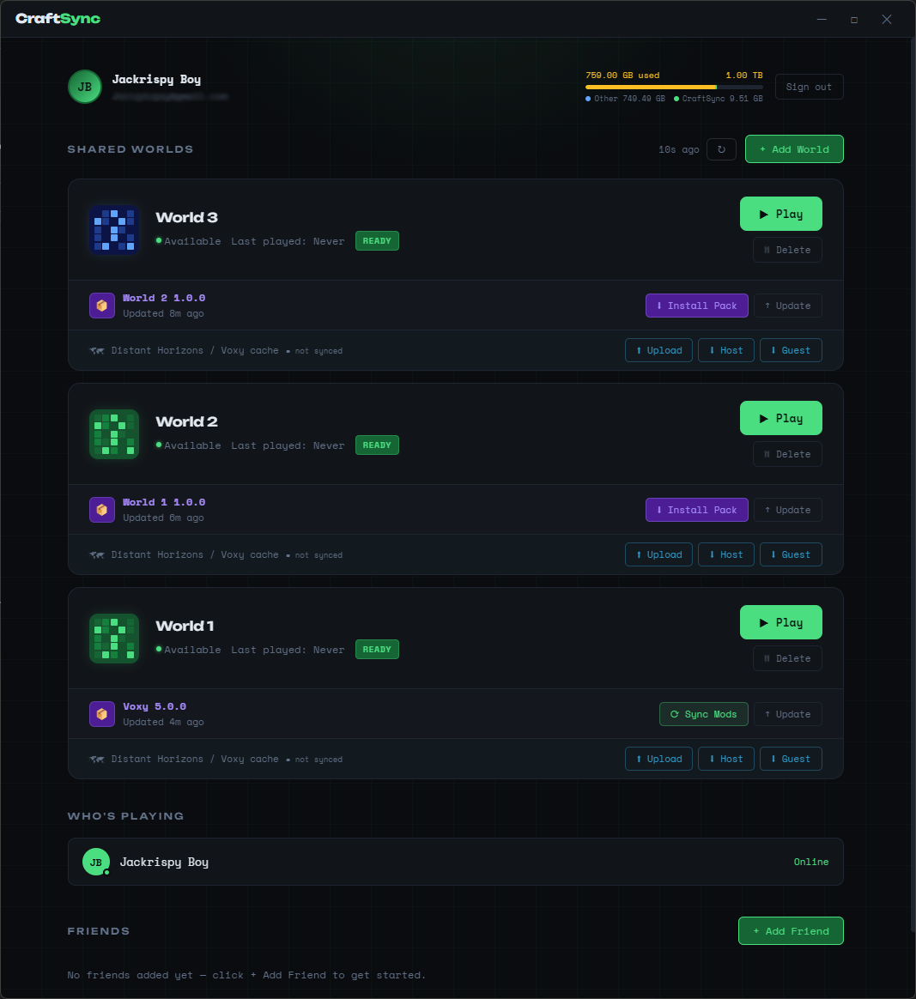
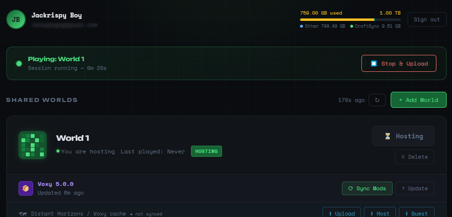
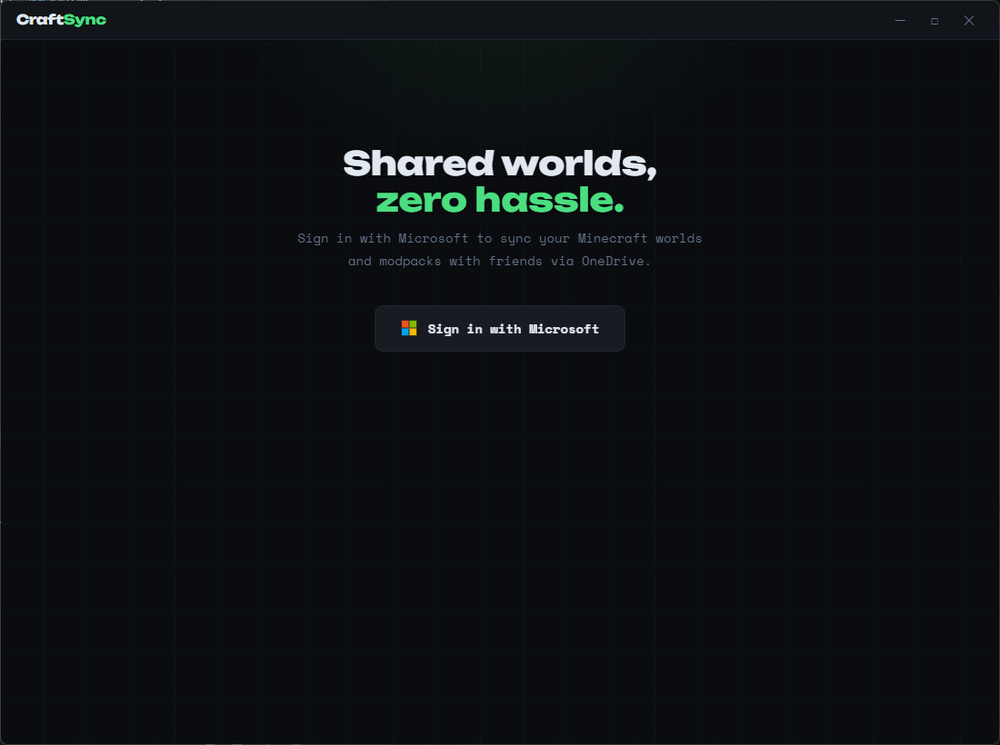
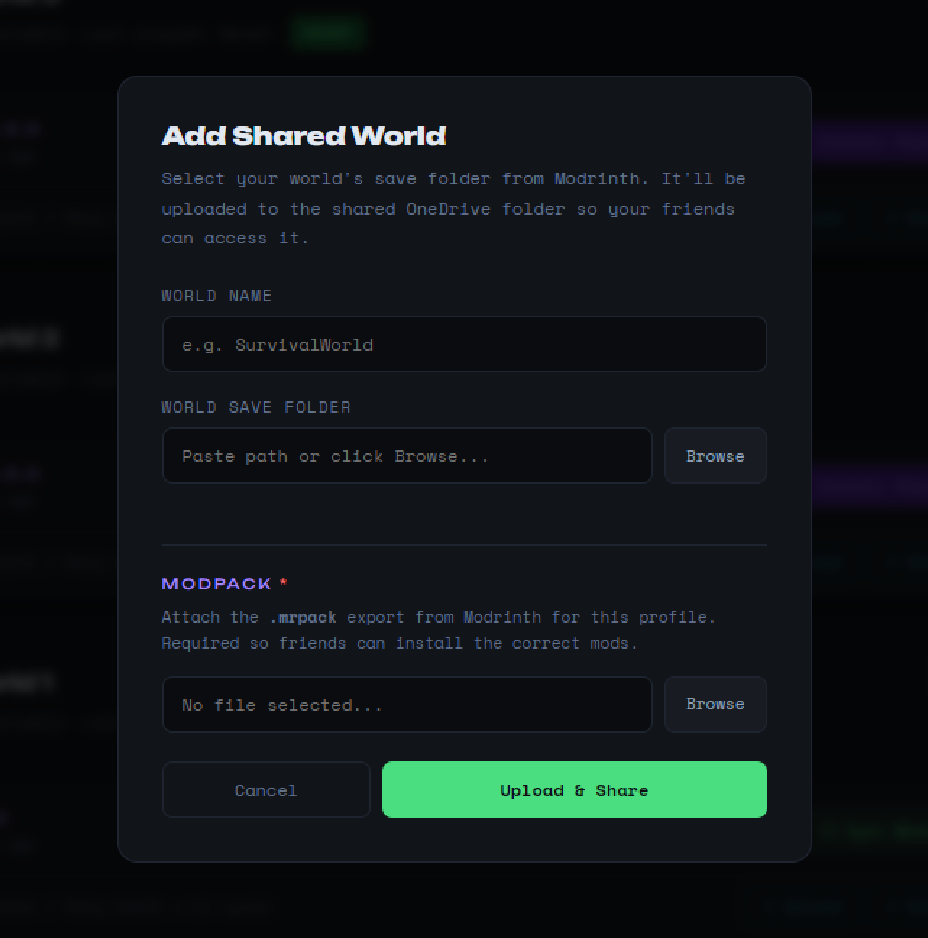
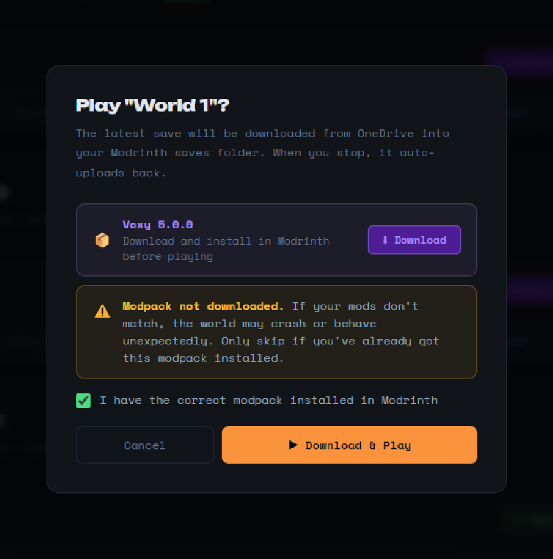
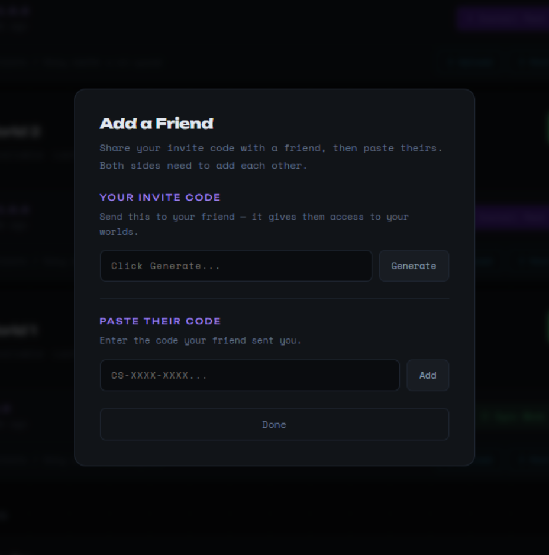
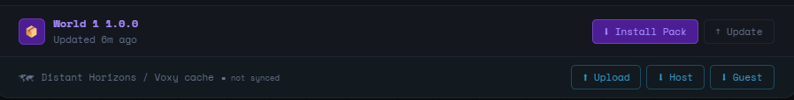

# CraftSync

> Sync Minecraft worlds with friends — no server required.

CraftSync is a Windows desktop app that lets you and your friends share a Minecraft world over OneDrive. One person hosts the world, uploads it after each session, and everyone else downloads the latest version before they play. No dedicated server, no port forwarding, no complicated setup — just OneDrive and Modrinth.

---

## How It Works

CraftSync uses your personal Microsoft OneDrive to store the world save. When you finish a session, the app automatically uploads only the files that changed. When a friend wants to play, they download just those changes. The first upload and download take longer since the full world needs to be transferred — every session after that is fast.

[IMAGE: diagram showing upload/download flow between two players via OneDrive]

The app integrates directly with the **Modrinth launcher** — it reads your installed profiles, launches Minecraft with the correct version, and handles authentication automatically.

---

## Features

- **Automatic world sync** — world uploads automatically when you close Minecraft, downloads automatically when you click Play
- **Delta sync** — after the first upload, only changed files are transferred. A typical 30-minute session uploads 5–50MB instead of the full world
- **Modpack management** — attach a `.mrpack` modpack to your world so everyone plays with the same mods
- **Mod sync** — sync mods, resource packs, and shader packs directly from the host's Modrinth profile
- **Voxy & Distant Horizons cache** — upload and download chunk pre-render caches so friends don't have to regenerate them
- **Who's Playing** — see which friends are currently online in the app
- **Friend invite system** — add friends via a simple invite code (`CS-XXXX`), no account linking required
- **World locking** — the world locks while someone is playing so two people can't edit at the same time
- **Multi-world support** — manage multiple worlds, each with their own modpack and settings

  *I CANNOT ACCESS YOUR MICROSOFT ACCOUNT THROUGH THIS APP IT IS COMPLETELY CLIENT SIDE*

---

## Requirements

- Windows 10 or 11
- [Modrinth launcher](https://modrinth.com/app) — installed and signed in with a Minecraft account
- A Microsoft account with OneDrive (free 5GB tier works for smaller worlds)
- The world's Minecraft version installed in Modrinth before playing

---

## Installation

1. Download `CraftSync Setup 1.0.0.exe` from the [Releases](../../releases) page
2. Run the installer — Windows may show a SmartScreen warning, click **More info** → **Run anyway** (this is normal for new apps without an established download history)
3. Sign in with your Microsoft account when prompted
4. CraftSync will create a `CraftSync` folder on your OneDrive automatically

---

## Getting Started

### Adding your first world (host)

1. Click **+ Add World**
2. Select the world save folder from your Modrinth profile's `saves/` directory
3. Select the `.mrpack` file for the modpack your world uses
4. Give the world a name and click **Upload**
5. CraftSync will upload the full world zip and modpack — this is the one-time first upload and may take a while depending on world size and your upload speed
   

### Playing a world

1. Click **▶ Play** on the world card
2. The first time on a new PC, CraftSync downloads the full world zip. After that it only downloads what changed
3. Minecraft launches automatically with the correct version and mods
4. When you close Minecraft, CraftSync automatically uploads your changes

### Adding friends

**As the host:**
1. Click **+ Add Friend** in the Friends panel
2. Share the generated `CS-XXXX` invite code with your friend via Discord, text, etc.

**As the friend:**
1. Click **+ Add Friend**
2. Paste the invite code you received
3. Your friend's worlds will appear in a separate section on the main screen

---

## Modpack & Mods

### Attaching a modpack
When you add a world you'll be asked to select a `.mrpack` file. This is the Modrinth modpack file for the profile you're playing on. Friends will be prompted to download and install it in Modrinth before they can play.

### Syncing mods
If the host updates their mods, they can use **⟳ Sync Mods** to re-upload the mods, resource packs, and shader packs. Friends can then click **⟳ Sync Mods** on their end to download and replace their local folders automatically.

### Mod mismatch warning
If your local mods don't match the world's recorded modlist, CraftSync will warn you before launching. Use Sync Mods to fix this automatically.

---

## Voxy & Distant Horizons Cache

If you use **Voxy** or **Distant Horizons** for chunk pre-rendering, CraftSync can sync the cache so friends don't have to spend hours generating it themselves.

**To upload your cache:**
- Click **⬆ Upload** on the cache strip on the world card
- CraftSync uploads your Voxy and/or DH cache folders as zip files to OneDrive

**To download the cache:**
- Click **⬇ Host** if you will be hosting the session (playing via Modrinth saves)
- Click **⬇ Guest** if you will be joining via Essential multiplayer
- For guest cache: you must have joined a hosted session at least once first so Voxy creates the correct folder structure

---

## Limitations

- **Windows only** — CraftSync is built for Windows 10/11. Mac and Linux are not supported.
- **Modrinth launcher required** — the app reads directly from Modrinth's database to find profiles and authenticate. Other launchers (CurseForge, Prism, vanilla) are not supported.
- **OneDrive storage** — your world save, modpack, and caches all count toward your OneDrive storage. A free 5GB account works for worlds under ~2GB. Larger worlds require a Microsoft 365 subscription (1TB OneDrive included).
- **Upload speed** — the first upload of a large world can take a long time depending on your internet upload speed. Subsequent delta uploads are much faster.
- **One player at a time** — the world locks while someone is playing. Two people cannot edit the world simultaneously — this would cause conflicts. Join mode (Essential multiplayer) lets multiple people play together with one person hosting.
- **Essential mod required for multiplayer** — if friends want to play together at the same time, the host plays normally and others join via the **Launch & Join** button, which requires the [Essential mod](https://essential.gg) to be installed in the profile.
- **Session.lock** — if Minecraft crashes, the world may stay locked. Use the **Force Unlock** option on the world card to release it manually.

---

## Storage Guide

| World size | First upload | Per session (delta) | Recommended |
|---|---|---|---|
| Under 500MB | ~2 min | Seconds | ✅ Ideal |
| 500MB–2GB | 5–15 min | Under 1 min | ✅ Good |
| 2GB–5GB | 15–40 min | 1–2 min | ⚠️ Large |
| Over 5GB | 40+ min | 2–5 min | 🔴 Very large |

Upload times assume ~50 Mbps upload speed. Your times may vary.

---

## FAQ

**Does everyone need a Microsoft account?**
Yes — each person signs in with their own Microsoft account. The invite code system links everyone together without needing to share passwords or credentials.

**Can I use a free OneDrive account?**
Yes, but the free tier is 5GB. If your world plus cache is larger than that you'll hit the limit. Microsoft 365 Personal (~£6/month) includes 1TB.

**What if two people try to play at the same time?**
The world locks when someone clicks Play. The second person will see a "World is locked by [name]" message and won't be able to download until the first person finishes and their changes upload.

**Can I use CraftSync with an existing world?**
Yes — when you add a world, select the save folder from your existing Modrinth profile. CraftSync will upload it as-is.

**Does CraftSync work with modded worlds?**
Yes — this is what it's designed for. Attach the `.mrpack` file so everyone has the correct mods, and use Sync Mods to keep everyone up to date.

**What happens if my upload fails halfway through?**
CraftSync has automatic retry logic for connection drops. If it fails completely, the world will be unlocked and you can try again. The next attempt will only upload what hasn't been uploaded yet.

---

## Support & Donations

CraftSync is free to use. If you find it useful and want to support development:

☕ [Buy me a coffee on Ko-fi](https://ko-fi.com/YOURNAME) — (INSERT YOUR KO-FI LINK)

For bug reports and feature requests, open an [Issue](../../issues) on GitHub.

---

## License

CraftSync is source-available. You may view and contribute to the code but may not redistribute it or use it commercially without permission.

© 2026 CraftSync
